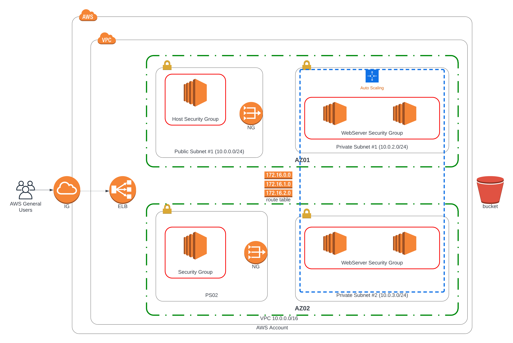

# Udagram
The following document contains instructions on how to deploy a highly available web application using AWS CloudFormation.

## Architecture Diagram

## Infrastructure Deployment

The application infrastructure consists of deploying the following stacks:
1. Network. This includes VPC, two pairs of public and private subnets, Internet Gateway, NAT Gateways and Routing Tables for public and private subnets with associations.
2. Hosts_(Optional)_. These are EC2 instances for troubleshooting of application web servers.
3. Application services. In particular, Load Balancer, web servers and corresponding autoscaling, target and security groups.

### Create infrastructure

To create the infrastructure stack run the following commands in the same order as below:

1. `./create.sh [stack name] network_infrastructure.yaml network_infrasructure_params.json`                                    

2. `./create.sh [host name] host.yaml host_params.json` 

3. `./create.sh [app server name] app_server.yaml app_server_params.json`  

### Verify deployment

To check whether the web application is running, follow the web application public URL, which could be found in output exports of app_server cloud formation stack.

### Update infrastructure

To update the already existing infrastructure stack run one (or all) the following commands:

1. `./update.sh [stack name previously created] network_infrastructure.yaml network_infrastructure_params.json`                                    

2. `./update.sh [host name previously mentioned] host.yaml host_params.json`    

3. `./update.sh [app server created] app_server.yaml app_server_params.json`  

### Delete infrastructure

To delete the infrastructure stack run the following commands in the same order as below:

1. `./delete.sh app_server`  

2. `./delete.sh host`  

3. `./delete.sh network_infrastructure`  
